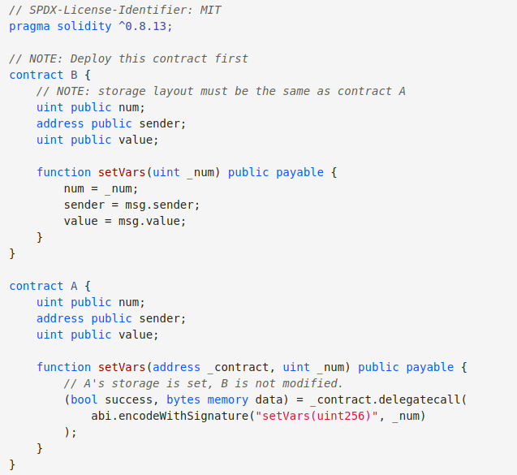
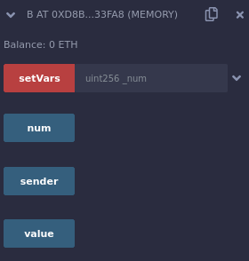
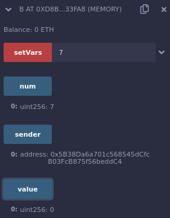
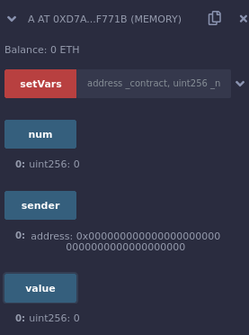
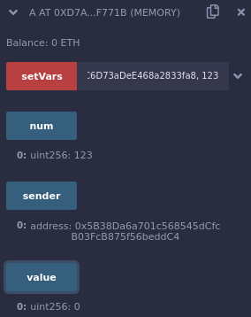

**Hardhat Upgrades**

For understanding what is upgrades and why we need them refer back to my [Day22](https://github.com/spo0ds/Journey-to-become-a-Blockchain-Engineer/blob/main/Day22/Day22.md).

**Delegate call**

It's going to be really similar to the call function which we've learned much earlier.It like one contract burrowing a function of another contract.We're going to take example of [soidity by example ](https://solidity-by-example.org/delegatecall/) website.



We have a couple of storage variables, function called setVars which updates our num.As we learned before, whenever we've some type of contract with storage variables they get stored in storage data structure that index's starting from zero.Right now num is at index 0, sender is at 1 and value is at index 2.

Contract A is going to use the delegate call function.Contract A is going to look a little bit different but it's still going to have setVars function except it's going to make a delegate call fuction call to our contract B.This `_contract.delegatecall` does very similar to call.Normally is we did contract.call on the contract B, we'd just be calling setVars function which would update contract B storage but instead we're saying "Call that setVars function and pass input parameter but call it in contract A".We're kind of burrowing the function.The difference is that variables could be different in contract A from contract B.Instead of num, we could use any variable.

So in our remix let's deploy the contract B first.After we deploy, we have a contract, num, sender and value.



We'll update the num to "7".



Now let's deploy contract A.



We've this contract with num, sender and value with all blanks but when we call setVars it's going to burrow setVars function of contract B and run it in contract A.We can almost think of it as copying and pasting setVars function to contract A just for 1 run and then deleting it.

When I call setVars, we're going to pass the contract address of B so it knows to call the setVars of the contract B function and pass it the value "123", since we're burrowing the function we're not going to update the num in contract B.We're going to update the num in contract A.So when I hot setVars of contract A, we can see num of contract A set to 123.



The way that this works is it actually doesn't look at the name of the storage variables.It looks at the storage slots.So when we burrow the setVars function using delegatecall, so we could have the variables name anything.Instead of num, we could call firstValue, second value we could call, theCaller and thirst to theValue and when we burrow the function using delegate call, instead of us actually grabbing the name of the variables, our contract will swap out the variables name with the storage slots.

It says,"You're accessing num variable which is at slot 0."So when we burrow setVars in contract A with delegate call,we'll say "storageSlot[0] = _num" which for contract A slorageSlot[0] is the "firstValue."So it's firstValue = _num.theCaller is going to be storageSlot[1] and we're going to update storageSlot[1] to msg.sender and so on.This is essentially what's going on behind the scenes.

Even if you don't have variables, it'll still save to storage slots.So in contract A if we didn't have any of those variable names, storage slot 0, 1 and 2 would still get updated.

Here's where things get really interesting and let's change the type of the contract A firstValue.

```solidity
contract A {
    bool public firstValue;
    address public theCaller;
    uint public theValue;

    function setVars(address _contract, uint _num) public payable {
        // A's storage is set, B is not modified.
        (bool success, bytes memory data) = _contract.delegatecall(
            abi.encodeWithSignature("setVars(uint256)", _num)
        );
    }
}
```

Now let's deploy contract A.Now when we call setVars in contract A, it's still going to use the setVars function of contract B which takes uint and assigns the first storage slot that number we pass in but our first storage slot is now a boolean.So what do you think is going to happen now?

Our transaction will actually goes through and when we look at firstValue it says "true".What if we change the setVars to 0? firstValue will be false.When we add a number with setVars, it's going through because it's just setting the storage slot of the boolean to the number and when solidity reads it, it says "First value is boolean.So anything other than 0 is going to be true."So this is how you can actually get some really weird result if your typings are different or if your storage variables are different.

What of we made the firstValue to address?This is where working with delegate call can get really weird.


