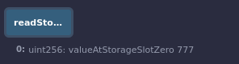

**Hardhat Upgrades**

For understanding what is upgrades and why we need them refer back to my [Day22](https://github.com/spo0ds/Journey-to-become-a-Blockchain-Engineer/blob/main/Day22/Day22.md).

**Delegate call**

It's going to be really similar to the call function which we've learned much earlier.It like one contract burrowing a function of another contract.We're going to take example of [solidity by example ](https://solidity-by-example.org/delegatecall/) website.


We have a couple of storage variables, function called setVars which updates our num.As we learned before, whenever we've some type of contract with storage variables they get stored in storage data structure that index's starting from zero.Right now num is at index 0, sender is at 1 and value is at index 2.

Contract A is going to use the delegate call function.Contract A is going to look a little bit different but it's still going to have setVars function except it's going to make a delegate call fuction call to our contract B.This `_contract.delegatecall` does very similar to call.Normally is we did contract.call on the contract B, we'd just be calling setVars function which would update contract B storage but instead we're saying "Call that setVars function and pass input parameter but call it in contract A".We're kind of burrowing the function.The difference is that variables could be different in contract A from contract B.Instead of num, we could use any variable.

So in our remix let's deploy the contract B first.After we deploy, we have a contract, num, sender and value.


We'll update the num to "7".


Now let's deploy contract A.


We've this contract with num, sender and value with all blanks but when we call setVars it's going to burrow setVars function of contract B and run it in contract A.We can almost think of it as copying and pasting setVars function to contract A just for 1 run and then deleting it.

When I call setVars, we're going to pass the contract address of B so it knows to call the setVars of the contract B function and pass it the value "123", since we're burrowing the function we're not going to update the num in contract B.We're going to update the num in contract A.So when I hot setVars of contract A, we can see num of contract A set to 123.


The way that this works is it actually doesn't look at the name of the storage variables.It looks at the storage slots.So when we burrow the setVars function using delegatecall, so we could have the variables name anything.Instead of num, we could call firstValue, second value we could call, theCaller and thirst to theValue and when we burrow the function using delegate call, instead of us actually grabbing the name of the variables, our contract will swap out the variables name with the storage slots.

It says,"You're accessing num variable which is at slot 0."So when we burrow setVars in contract A with delegate call,we'll say "storageSlot[0] = _num" which for contract A slorageSlot[0] is the "firstValue."So it's firstValue = _num.theCaller is going to be storageSlot[1] and we're going to update storageSlot[1] to msg.sender and so on.This is essentially what's going on behind the scenes.

Even if you don't have variables, it'll still save to storage slots.So in contract A if we didn't have any of those variable names, storage slot 0, 1 and 2 would still get updated.

Here's where things get really interesting and let's change the type of the contract A firstValue.

```solidity
contract A {
    bool public firstValue;
    address public theCaller;
    uint public theValue;

    function setVars(address _contract, uint _num) public payable {
        // A's storage is set, B is not modified.
        (bool success, bytes memory data) = _contract.delegatecall(
            abi.encodeWithSignature("setVars(uint256)", _num)
        );
    }
}
```

Now let's deploy contract A.Now when we call setVars in contract A, it's still going to use the setVars function of contract B which takes uint and assigns the first storage slot that number we pass in but our first storage slot is now a boolean.So what do you think is going to happen now?

Our transaction will actually goes through and when we look at firstValue it says "true".What if we change the setVars to 0? firstValue will be false.When we add a number with setVars, it's going through because it's just setting the storage slot of the boolean to the number and when solidity reads it, it says "First value is boolean.So anything other than 0 is going to be true."So this is how you can actually get some really weird result if your typings are different or if your storage variables are different.

What of we made the firstValue to address?This is where working with delegate call can get really weird.


**Small Proxy Example**

```solidity
// SPDX-License-Identifier: MIT

pragma solidity ^0.8.7;

import "@openzeppelin/contracts/proxy/Proxy.sol";
```

We're importing Proxy.sol from OpenZeppelin.OpenZeppelin has this minimalistic proxy contract that we can use to actually start woking with this delegate call. This contract uses lots of assembly called "Yul" and it's an intermediate that can be compiled to bytecode for different backends.It's a sort of `inline assembly` inside Solidity and allows you to write really low level code close to the opcodes.

In the [Proxy.sol](https://github.com/OpenZeppelin/openzeppelin-contracts/blob/master/contracts/proxy/Proxy.sol) contract, we've the delegate function which inside of it is inline assembly which does low level stuff but the main thing it does is goes ahead and does delegate call functionality.If we look we can see it's using fallback and receive function.So whenever it receives a function that doesn't recognize, it'll call fallback and fallback call our delegate function.So anytime a proxy contract receives data for a function it doesn't recognize, it sends it over to some implementation contract where it'll call it with delegate call.

```Solidity
contract SmallProxy is Proxy {
    // This is the keccak-256 hash of "eip1967.proxy.implementation" subtracted by 1
    bytes32 private constant _IMPLEMENTATION_SLOT =
        0x360894a13ba1a3210667c828492db98dca3e2076cc3735a920a3ca505d382bbc;

    function setImplementation(address newImplementation) public {
        assembly {
            sstore(_IMPLEMENTATION_SLOT, newImplementation)
        }
    }

    function _implementation()
        internal
        view
        override
        returns (address implementationAddress)
    {
        assembly {
            implementationAddress := sload(_IMPLEMENTATION_SLOT)
        }
    }
}
```

In our minimalistic example here, we have a function called setImplementation which will change where those delegate calls are going to be sending.This could be equivalent to upgrading your smart contract and the we've _implementation to read where that implementation contract is.

Now to work with proxies, we really don't want to have anything in storage because if we do delegate call and that delegate call changes some storage, we're going to screw up our contract storage.The one caveat though to this, we do still need to store that implementations address somewhere so we can call it.

So [EIP-1967](https://eips.ethereum.org/EIPS/eip-1967) which is an Ethereum improvement proposal for having certain storage slots specifically used for proxies.In our minimalistic example, we set _IMPLEMENTATION_SLOT to that location in storage and whatever is that storage slot, it's going to be the location of the implementation address.

So the way proxy is going to work is any contract that calls the proxy contract, if it's not the setImplementation function, it's going to pass it over to whatever is inside the implementation slot address.That's what we're going to build here.We'll create a real minimalistic contract.

```solidity
contract ImplementationA {
    uint256 public value;

    function setValue(uint256 newValue) public {
        value = newValue;
    }
}
```

This is going to be our implementation.So now anytime someone calls SmallProxy it's going to delegate call over to ImplementationA and then save the storage in our SmallProxy address.We're going to call SmallProxy with the data to use the setValue function selector. 

So let's make it a little easier just to figure out how to get that data by creating a new helper function.We can get the data with abi.encodeWithSignature.We'll give it the number that we want to call  a new value.

```solidity
// helper function
    function getDataToTransact(uint256 numberToUpdate)
        public
        pure
        returns (bytes memory)
    {
        return abi.encodeWithSignature("setValue(uint256)", numberToUpdate);
    }
```

We know when we call ImplementationA from our SmallProxy, we're going to update SmallProxy storage.So we'll create a function in solidity just to read our storage in SmallProxy.

```solidity
function readStorage()
        public
        view
        returns (uint256 valueAtStorageSlotZero)
    {
        assembly {
            valueAtStorageSlotZero := sload(0)
        }
    }
```

In assembly `:=` this is how we set things.We're reading directly from storage.Now let's go ahead and deploy SmallProxy and ImplementationA.


SmallProxy has a function setImplementation.So anytime we call the proxy contract, we're going to delegate call over to     ImplementationA.We're going to grab ImplementationA address and pass it to the setImplementation function.


So if we call SmallProxy with 777 value, proxy contract is going to go "I don't see that function."We're going to call fallback which is coming from OpenZeppelin and it's going to do the delegate.We're going to call our fallback function  and get the function in ImplementationA borrow it and use it ourself.

So if I copy the bytes data of 777, implementation has been set to the contract address.When I go ahead paste the bytes into calldata and hit transact, then if I read storage, we see it's indeed 777.

Before passing bytes:


After passing bytes:



This is incredibly beneficial because now we can update our code.If we don't like contract ImplementationA anymore, so let's create ImplementationB.

```solidity
contract ImplementationB {
    uint256 public value;

    function setValue(uint256 newValue) public {
        value = newValue + 2;
    }
}
```

Let's deploy ImplementationB.We'll grab it's address and set it in SmallProxy and essentially we've now upgraded from ImplementationA to ImplementationB.

Now if we use the same bytes which is still going to call setValue but now instead we're delegate calling to implementation B.


This is the minimalistic example of how upgrading actually works.Now this is incredibly beneficial because we can always just tell people to make function call to SmallProxy and you'll be good to go but this also means developers of this protocol can essentially change the underlying logic at any time.This is why it's so important to read contracts and check to see who has the developer keys and if a contract can be updated.If a contract can be updated and a single person can update it, you've single centralized point of failure and technically contract isn't even decentralized.

**Function Selector Clashes**

Right now whenever we call setImplementation, the proxy function setImplementation gets called because we don't trigger the fallback because the function is there.However if I have a function called setImplementation in our Implementation, this can never be called.Whenever we send a function signature of setImplementation, it's always going to call the one on the proxy.This is where the transparent proxy that we're going to be working with help us out here and universal upgradeable proxy can too.
