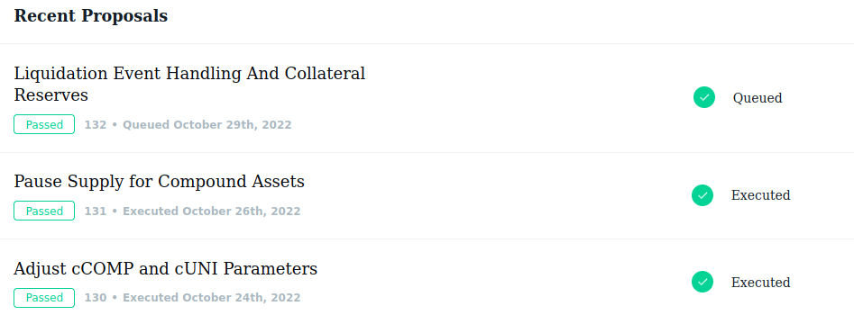
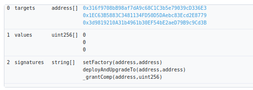
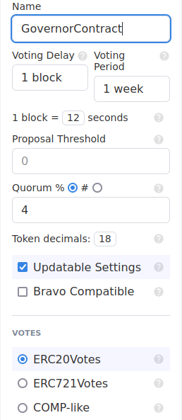
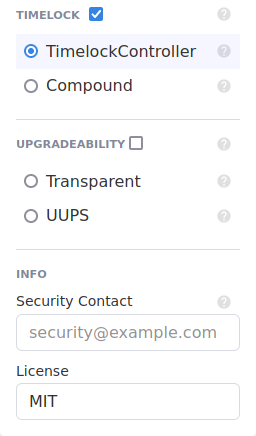
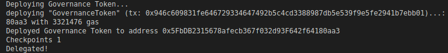
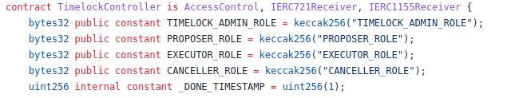
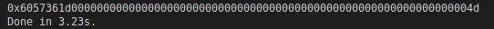
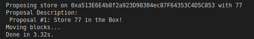

**Build a DAO**

**What is a DAO**

DAOs are for decentralized autonomous organizations, which describes any group that is governed by a transparent set of rules found on a blockchain or smart contract. Some people say "Bitcoin is DAO because the miners choose whether or not to upgrade their software." Other people think that DAOs must use transparent smart contracts, which have the rules ingrained right into them.

It's not to be confused with "The DAO," which was an implementation of a DOW back in 2016, which set the record for a hack at that time. The DAO term is used in a lot of different ways, but in essence, imagine if all the users of Google were given voting power on what Google should do next and the rules of the voting were immutable, transparent, and decentralized. This solves an age-old problem of trust, centrality, and transparency and gives power to users of different protocols and applications instead of everything happening behind closed doors, and this voting piece is a cornerstone of how these operate.

This can be summarized by "company or organization operated exclusively through code." To really understand this, we're going to look under the hood of the protocol that's setting the precedent for all other DAOs, "[Compound](https://compound.finance/). Once we look at the compound, we'll understand what goes into building one of these and all the trade-offs, all the different architectural choices mean for your group.

Compound is a borrowing and lending application that allows users to borrow and lend their assets, and everything about the application is built on smart contracts. They're going to oftentimes do a lot of new things. Maybe they want to add a new token to allow borrowing and lending. Maybe they're going to want to change some of the APY parameters. Maybe they want to block certain coins. There are a lot of different things that they might want to do. So that's why we're going to head to [governance](https://compound.finance/governance).

This is where you can find a user interface for a list of all proposals and all the different ballots that came to be. So here's the list of some of the governance proposals that this protocol has actually been making to improve.



So if we click on the proposal, we can actually see everything about the proposal; who voted for, who voted against, and the proposal's history. The first requirement for one of these proposals is that it be created in a proposed transaction, which we can see right here (https://etherscan.io/tx/0xabfaeb6d3b39b69fbaee824a08d7b7a11726c03f8990411f0bb27ecf46b76769).If we decode the input data, we can actually see the exact set of parameters they used to make the proposal. The way they're typically divided is that they've got a list of addresses, functions to call on those addresses, and parameters to pass those addresses.



So this proposal is saying, "I would like to call setFactory on those first and second addresses, deployAndUpgradeTo on those two addresses, and the parameters that we're going to pass are on calldata, which is encoded in bytes, and a description string provides what it is doing and why we're actually doing this." The reason that we've got to do this proposed governance process is that these contracts likely have access controls where only the owner of these contracts can call those functions, and the owner of these contracts is likely going to be the governance DAO.

Once the proposal has been created, after a short delay, it becomes active and this is when people can actually start voting on it. This delay between the proposal and an act of vote can be changed or modified depending on your DAO. Then people will have some time to start voting on them, and if they pass, it means they succeeded.

If we go to the [compound governance](https://etherscan.io/address/0xc0da02939e1441f497fd74f78ce7decb17b66529) contract, go to contract, write as Proxy, and we can see the exact function that people call to vote, namely castVote, castVoteBySig, and castVoteWithReason. We'll talk a little bit about the exact differences between these in a little bit, but these are the functions that they're actually calling for, and if you go to the compound app and go over to [vote](https://app.compound.finance/#vote), this is a user interface you can actually vote through to make it easier if you're not as tech savy, or you could send the transaction yourself.

Once all those votes happen, it reaches the queued stage. Before a proposal actually becomes active, there's a minimum delay between a proposal passing and a proposal being executed. So somebody has to call this queued function, and it can only be called if a vote passes and it says, "The proposal ID has been queued and we're going to execute it soon." Now if we go to the different proposals, we can see the execution where they executed the proposal with proposal ID.

Oftentimes, just putting one of these proposals through isn't really enough to really garner some votes for it. You generally want a forum or some type of discussion place to talk about these proposals and why you like them or don't like them. Often, a [discourse] (https://www.discourse.org/) is one of the main places where people will argue about why something is good or bad, so that people can vote on these changes. Snapshot might be one of these tools that you use to figure out if your community even wants something before it even goes to vote. You can join one of these and with your tokens you can actually vote on them without being executed just to get the sentiment, or you can build your protocol in a way that Snapshot actually helps you with the voting process.

Now that we know what a DAO looks like, let's talk about the architecture and tools that go into building one of these and, additionally, the tradeoffs that they have. The first thing to talk about is the `Voting Mechanism`.

Now, voting in decentralized governance is critical to these DAOS because sometimes they do need to update and change to keep up with the time,Not all protocols need to have a DAO, but those that do need to have a DAO need a way for participants to engage. This is one of the most important questions to ask and tell your communities: `How do I participate? How do I engage in this DAO? How do I help make a decision?` and you'll find this is a bit of a tricky problem to solve.

Now, an easy approach to this problem is going to be using an ERC20 or an NFT token as voting power, similar to what we saw in the compound. We use comp tokens to vote for different proposals. Now this actually might be the right approach for certain doubts, but it also runs the risk of actually being less fair because when you tokenize the voting power, you're essentially auctioning off voting power to whoever's got the deepest pockets. So if it's only the rich people who get to vote, then it's highly likely that all the changes in the protocol are going to benefit the rich, which doesn't seem like that great of an improvement over our current world. Additionally, if you buy a whole bunch of votes and you make a bad decision, then sell all your votes. You as an individual don't really get punished, you just punish the group as a whole. But if you're malicious, you can get away with pretty much anything.

This voting mechanism is going to be correct for some groups, but for other groups, maybe not. It really depends on what your DAO community setup is going to look like. Now the next thing that we're going to talk about is `skin in the game`.It means whenever you make a decision, your vote is recorded, and if that decision leads to a bad outcome, your tokens are axed. You get punished for making evil or bad decisions for your DAO and your protocol. This mentality is good because even if you buy a ton of tokens and decide to be ill with it, you can be held accountable for your bad decisions.

The most difficult part of this is going to be deciding as a community. What is a bad outcome? How do we actually punish people ? The answer is not certain.

The third method of this voting mechanism is probably one of the most interesting ones, but also the hardest one to implement. This is `proof of personhood or participation`.Imagine that all users of the compound protocol were given a single vote simply because they use the protocol, and even if they had a thousand wallets, they use the protocol. One human being means one vote. This would be an amazing and far more fair implementation where votes couldn't actually be bought. The issue, however, comes from something known as `Sybil resistance`.How can we be sure that one vote equals one participant and not one pretending to be 1000s of different people so they get more votes? This method hasn't been solved yet.

Now, as you can see, all these methods, and even more that you probably think of, aren't that farfetched, and we actually see these exact same methods happening in the real world. Proof of Personhood or Participation might just be the exact same as some of the regular government voting that we see everyday. One person gets to vote for one president. You can't just make a bunch of fake people and vote for the president. But in companies, the ERC20 voting standard kind of applies. The more shares of a company you own, the more voting power you have in that company.

So we can draw parallels between the real world and how voting and governance are going to work in our smart contracts. When it comes to the implementation of voting, there are usually two categories: `On-chain voting` and `Off-chain voting`.On-chain voting is exactly what we saw with compound. Your voter, the smart contract on chain. You call some function called "vote" with your metamask or your ledger, send a transaction, and you've voted.

`What do transactions use that's annoying and costly? Yeah, gas. Imagine you've got 10,000 people in your community and it costs $100 to vote per person. You're now costing your community $1 million every time you want to change anything. This is obviously insane and not very sustainable for your community. The pro here is that the architecture is really easy; everything's going to be transparent and on-chain, but the con is that you're going to break bank accounts for a lot of people potentially.

Now there are lots of variations of this to help solve some of these problems, especially the gas problem. One of the ones that's worth taking is `Governor C` where they use some random sampling to do some quadratic voting to help reduce costs while increasing sybil resistance.

You can vote off-chain and be 100% decentralized. You can actually sign a transaction and sign a vote without actually sending it to the blockchain and, therefore, without actually spending any gas. Instead, what you can do is send that signed transaction to a decentralized database like IPFS, count up all the votes in IPFS, and then, when time comes, deliver the result of that data through something like an oracle like chainlink to the blockchain all in a single transaction.

Alternatively, you could replay all the side transactions in a single transaction to save gas. This can reduce the voting cost by up to 99%. Right now, this is an implementation, and one of the most popular ways to do this is through snapshots. This option voting mechanism obviously saves a ton of gas to the community and can be a more efficient way to store these transactions anyway. However, it needs to be implemented very carefully. If you run your entire DAO through a centralized oracle, you're essentially re-introducing a centralized intermediary and ruining the decentrality of your application.

Let's learn about some of the tools that you can use to help get you up to speed quicker. There are a number of no-code solutions that you can use when building one of these DAOs. DAO Stack, Aragon, Colony, and DAO House are all alternatives that can actually help you with the upside of running a DAO and building a DAO. However, if you want more granular control and you don't want to have to pay any fees associated with the protocols, you might want to do it from scratch.

Let's look at some of the cody solutions that you can use. Snapshot is one of the most popular tools out there for both getting the sentiment of a DAO and actually performing that execution. Users can vote through this protocol with their actual tokens. Those transactions get stored in IPFS, but none of them gets executed unless the DAO chooses to. This can be a great way to get a feel for what your DAO wants to do, and optionally, you can send the transactions and execute the votes as well. `Zodiac` is a suite of DAO-based tools for you to implement in your DAO as well. `Tally` is another one of these UIs that allows people to see, actually vote on, and interact with these smart contracts through a UI.

For those of you who don't know about `Gnosis Safe`, it's a multi-sig wallet and even if it adds a centrality component, most DAOs beginning are probably going to start with some type of centrality. It's much easier to be fast when you don't have 1000s of people to wait for a vote, and in the beginning, any protocol is going to be centralized to some degree anyway. Using a multisig, where voting happens through only a few key members, can be good in the beginning for your DAOs and often in emergencies as well. But just keep in mind that when you add one of these, you're also adding the level of centrality.

The future of DAOs is interesting for all these reasons that we just talked about, but especially on the legal front. Does it make sense for a DAO to live by the same regulations as another company? Why would you even force a DAO to do something? It's a little gray. It's hard to nail down who to even keep accountable for these DAOs.


**How to build a DAO**

We're going to build our own DAO inspired by compound.This is going to be on-chain voting and on-chain governance.We're going to learn an easiest way to spin up an NFT or ERC20 voting type DAO all using solidity and hardhat.

We're going to have a very basic smart contract called "Box" and all it can do is store a value and then retrieve a value but the thing is it's ownable and only the owner of the contract can call the store function and the owner is going to be the DAO.Only through a process of governance, can anyone store a different number.

Here's our agenda:
- Write the smart contracts.
- Write deployment scripts.
- Write scripts to interact with them. 

So let's jump in.

Let's create a new folder "hardhat-dao" and open the folder in VScode.Then we install hardhat.

`yarn add --dev hardhat`

After we install hardhat, we can run `yarn hardhat` and we're going to create an empty config.js project.Now let's go and create a "contracts" folder and here we'll add all of our contracts.The first contract that we want to add is the contract that we want to have govern which in our case is going to be Box.sol.

```solidity
// SPDX-License-Identifier: MIT
pragma solidity ^0.8.0;

import "@openzeppelin/contracts/access/Ownable.sol";

contract Box is Ownable {
    uint256 private value;

    // Emitted when the stored value changes
    event ValueChanged(uint256 newValue);

    // Stores a new value in the contract
    function store(uint256 newValue) public onlyOwner {
        value = newValue;
        emit ValueChanged(newValue);
    }

    // Reads the last stored value
    function retrieve() public view returns (uint256) {
        return value;
    }
}
```

We're importing from openzeppelin contracts, so we want to add this.

`yarn add --dev @openzeppelin/contracts`

Now we want to check to see if this compiles.

`yarn hardhat compile`

Let's create the governance part.We're going to be building off an ERC20 standard.So you're going to get an ERC20 token  and that's going to be the token that you get to vote.So create a new file "GovernanceToken.sol" and this is going to be the code for the token that we use to actually vote.

We're going to create a normal ERC20 token and then we're going to extend it to make it governance.

```solidity
// SPDX-License-Identifier: MIT

pragma solidity ^0.8.8;

import "@openzeppelin/contracts/token/ERC20/ERC20.sol";

contract GovernanceToken is ERC20 {}
```

We're going to change this but don't worry about that yet.We're going to mint an ERC20 token to whoever deploys the contract.

```solidity
contract GovernanceToken is ERC20 {
    uint256 public s_maxSupply = 1000000000000000000000000;

    constructor() ERC20("GovernanceToken", "GT") {
        _mint(msg.sender, s_maxSupply);
    }
}
```

If this was the normal ERC20 token, you're all done.But this isn't a normal ERC20 token.When we do votes, we need to make sure that it's fair.Imagine this for a second.Someone knows a hot proposal is coming up, they want to vote on.So they just buy a ton of tokens and then they dump it after the vote is over.We want to avoid this.We want to avoid people just buying and selling tokens to get in on governance.So we actually create a snapshot of how many tokens people have at a certain block.We want to make sure once a proposal goes through, we actually pick a snapshot from the past that we want to use.This kind of incentivizes people to not just jump in when it's a propsal and jump out because once proposal hits, it uses a block snapshot from the past.So we're actually going to need to change our GovernanceToken little bit.

We're going to change this from ERC20 to ERC20Votes.

```solidity
import "@openzeppelin/contracts/token/ERC20/extensions/ERC20Votes.sol";

contract GovernanceToken is ERC20Votes {
}
```

Some of the main functions are it has these checkpoints.

```solidity
function checkpoints(address account, uint32 pos) public view virtual returns (Checkpoint memory) {
        return _checkpoints[account][pos];
    }
```

These checkpoints are basically "Hey what is the snapshot?"

There's numCheckpoints.You can also delegate your token to different people.Maybe you're not available to actually vote, so you can give your token to somebody else.

You can get how many votes somebody has.

It has all these functions that make the token much better as a voting tool.

After we inherit from ERC20Votes, we need to add additional constructor  ERC20Permit.

```solidity
constructor()
        ERC20("GovernanceToken", "GT")
        ERC20Permit("GovernanceToken")
    {
        _mint(msg.sender, s_maxSupply);
    }
```

Now we have a governance token that is little bit capable of doing actual voting because it has the snapshot, delegating functionality and checkpoints  for doing votes in a fair way.

The only thing that we need to do is add some overrides.Anytime we do `_afterTokenTransfer`, we want to make sure that we call the _afterTokenTransfer of the ERC20Votes.

```solidity
    function _afterTokenTransfer(
        address from,
        address to,
        uint256 amount
    ) internal override(ERC20Votes) {
        super._afterTokenTransfer(from, to, amount);
    }
```

The reason that we do this is because we want to make sure that the snapshots are updated.We want to make sure that we know how many people have how many tokens at each checkpoints.

Same thing with the `_mint` and `_burn`.

```solidity
    function _mint(address to, uint256 amount) internal override(ERC20Votes) {
        super._mint(to, amount);
    }

    function _burn(address account, uint256 amount)
        internal
        override(ERC20Votes)
    {
        super._burn(account, amount);
    }
```

At which checkpoint are you going to use for your token voting.

Now we have a Governance Token that we can use for governance.

Let's actually start creating our Governance contracts.We're going to make a folder called "governance_standard" because this is going to be the standard governance model.This is going to be the on-chain ERC20.Inside it we need to contracts "GovernorContract" and "TimeLock" which will make sense in a second.

GovernorContract is going to be the contract that has all the voting logic that our governance token is going to use.The TimeLock is actually going to be an additional contract that is actually the owner.So these two contract are sort of one in the same but the difference is the TimeLock is going to be the owner of the Box contract.This  is important because whenever we propose or cue something to a proposal to go through, we want to wait.We want to wait for a new vote to be "executed".

Why do we want to do that?

Let's say some proposal goes through that's bad.We've a Box contract and a proposal goes through that says "Everyone that holds the governance token has to pay 5 tokens."This is something that you really don't want to be part of.So all of these governance contracts give time to users to "get out" if they don't like a governance update.So we always want to have some type of time lock.Once a proposal passes, it won't go in effect right away.It'll have to wait some duration and then go in effect.So that's what TimeLock is for.

OpenZeppelin has a thing called [Contracts Wizard](https://docs.openzeppelin.com/contracts/4.x/wizard).This wizard is a way for us to write really basic boilerplate code right in there wizard.




Voting Delay is the deplay since the proposal is created untill voting starts.So once we create a proposal, you gotta wait a little bit.

The voting period is how long votes should go for.The reason that 1 block = 13.2 seconds is imporant is because they actually do voting period in terms of blocks.So it's an anti pattern to actually do timed based things in smart contracts.It's much better to do block based things.We're saying 1 week but that's going to be if average blocktime is 13.2 seconds, we're going to figure out the week.

Proposal threshold is going to be the minimum number of votes an account must have to create a proposal.So maybe you only want people who have a lot of your governance token to make votes.

Quorum percentage is what percentage of people need to vote it all.So we're saying 4% of all token holders need to vote.

We also have some updatable settings and Brave compatible.Bravo is the compound type contract.So if you want to make it integratable with compound, you can do that.

Votes comp-like or ERC20Votes  and we're working with ERC20Votes.

We always want to do TimeLock  and we're doing the openzeppelin implementation of a time lock.

We are not going to do upgradability here.

This pretty much it.We're going to copy the whole code  and paste it in GovernorContract.

We've our GovernorContract which inherits from bunch of contracts.

```solidity
contract GovernorContract is
    Governor,
    GovernorSettings,
    GovernorCountingSimple,
    GovernorVotes,
    GovernorVotesQuorumFraction,
    GovernorTimelockControl
{
}
```

All these are just implementations to make it easier to be a governor.GovernorCountingSimple is a way of counting votes, GovernorVotes is a way of integrating with that ERC20 contract and QuorumFraction is a way to understand Quorum.

We'll talk about constructor later but let's talk about functions.We've a `votingDelay` which we're going to get from `GovernorSettings` contract that we're going to set.We've `votingPeriod` that we're going to set in our `GovornorSettings` and the rest function like `quorum`, `getVotes` and `state`.

Then we've some interesting function called `propose`.This is where we're actually going to do to propose new governance. We've `proposalThreshold`, `_execute` which executes queued proposal, `_cancel`, `_executor` which is going to be who can actually execute stuff and we're going to make it anybody and then `supportInterface` that you can ignore.

Let's make the parameter of GovernorSettings little bit more customizable.We've IVotes _token which is going to be our governance token, TimelockController _timelock which is going to be the timelock controller which we'll make and we need this because we don't want to let any proposal just go through once it passes.We want to give people time to get out.But let's add `_votingDelay` , `_votingPeriod`  and `_quorumPercentage`.

```solidity
    constructor(
        IVotes _token,
        TimelockController _timelock,
        uint256 _votingDelay,
        uint256 _votingPeriod,
        uint256 _quorumPercentage
    )
        Governor("GovernorContract")
        GovernorSettings(
            _votingDelay, /* 1 block */
            _votingPeriod, /* 45818 blocks ~= 1 week*/
            0
        )
        GovernorVotes(_token)
        GovernorVotesQuorumFraction(_quorumPercentage)
        GovernorTimelockControl(_timelock)
    {}
```

Now this is completely customizable for votingDelay, votingPeriod and quorumPercentage.


Now you've a simple Governance contract.This contract is going to have all the functions that we're going to go over for proposing, executing and for queuing different proposals.

Now we start to code on our TimeLock contract.We're going to import from openzeppelin a contract called the `TimelockController.sol`.This has all the functionality for creating roles, who can actually propose, who can execute, who's a timelock admin but it also has the execute stuff which is going to work in tandam with our governance contract.This contract makes sure that our Governance contract doesn't just push stuff through willy nilly.

```solidity
// SPDX-License-Identifier: MIT

pragma solidity ^0.8.0;

import "@openzeppelin/contracts/governance/TimelockController.sol";

contract Timelock is TimelockController {}
```

We'll create a constructor here  which takes couple of different parameters.It takes `minDelay` which is how long you have to wait before executing.Once the proposal passes, we need to wait this minDelay.Then we're going to list of `proposors` which is the list of the addresses that can propose  which for us is everyone to be able to propose and then at last an array of `executors` who can execute when a proposal passes.

```solidity
constructor(
        uint256 minDelay,
        address[] memory proposers,
        address[] memory executors
    ) {}
```

The reason that we need this is because we need to pass these to our TimelockController.

```solidity
contract Timelock is TimelockController {
    constructor(
        uint256 minDelay,
        address[] memory proposers,
        address[] memory executors
    ) TimelockController(minDelay, proposers, executors) {}
}
```

This is going to be what owns everything.Timelock is going to be owning our Box.It's not the GovernorContract.GovernorContract is where we're going to send our votes and stuff.But at the Timelock that actually everything needs to flow through in order for governance to actually happen because we want to make sure we have this minDelay,  go through right process and everything.


Now we're going to flip over to actually writing the scripts to deploy and interact with everything using Typescript here.We're going to use a package for deployment called `hardhat-deploy`.To install the package, we're going to do:

`yarn add --dev @nomiclabs/hardhat-ethers@npm:hardhat-deploy-ethers ethers`

Then we'll add hardhat-deploy.

`yarn add --dev hardhat-deploy`

This allows us to instead of having to write scripts and do all this stuff that kind of makes it hard to save your deployments, we're just going to create a deploy folder where we're going to add all of our deploy scripts.

Let's create a new file inside deploy folder called "01-deploy-governor-token.ts".Also we're going to change hardhat.config.js to typescript.

We need to install typescript and all it's stuff.

`yarn add  --dev typescript typechain ts-node @typechain/ethers-v5 @typechain/hardhat @types/chai @types/node`

Let's create a deploy script for a governor token.We're going to import hardhat runtime environment from hardhat types, import deploy function from hardhat-deploy  types and these are the two main thing that you need to create a deploy function with hardhat-deploy.

```typescript
import { HardhatRuntimeEnvironment } from "hardhat/types"
import { DeployFunction } from "hardhat-deploy/types"
```

We're going to create a function called deployGovernanceToken which is going to be of type deploy function so in order for this to actually work, we just create a whole bunch of deploy functions that we run with hardhat which is going to be an async function which takes hardhat runtime environment as a parameter.

```typescript
const deployGovernanceToken: DeployFunction = async function (hre: HardhatRuntimeEnvironment) {

}
```

So when we run hardhat-deploy, we're actually passing our fake hardhat chain that gets spun up in the background for us.

First we need an account to deploy this first.

```typescript
const { getNamedAccounts, deployments, network } = hre
```

We're getting these from hardhat runtime environment which is being updated from hardhat-deploy.So getNamedAccounts is a way for us to actually import accounts from hardhat-config right into our deploy script.So we're going to go to our hardhat-config and we're going to create a new config.First we need to import the hardhat config type.

```typescript
import { HardhatUserConfig } from "hardhat/config"
```

Then we're going to create a config which is going to be of type HardhatUserConfig.

```typescript
const config: HardhatUserConfig = {}
```

We'll add our default blockchain to be hardhat, networks to be hardhat and localhost, then the version of solidity and namedAccounts which is going to be the list of accounts that we can use.For accounts, we'll say deployer which will be the name of our account that does all the deploying in which default is going to be 0 so whenever we run on any chain our 0th account is going to be named deployer.

```typescript
const config: HardhatUserConfig = {
  defaultNetwork: "hardhat",
  networks: {
    hardhat: {
      chainId: 31337
    },
    localhost: {
      chainId: 31337
    }
  },
  solidity: "0.8.17",
  namedAccounts: {
    deployer: {
      default: 0,

    }
  }
}
```

Hardhat and localhost looks like they're pretty much same  but they're not and you'll understand in a second but we need them now just to tell hardhat that here are the development fake blockchains that we're working on.

Now that we've getNamedAccounts and network because anytime you deploy something, it's going to be on a network and when we deploy something by running `yarn hardhat node` hardhat is going to spin up a fake blockchain in the background which is a hardhat node running.

When you run hardhat node, oddly enough it's actually the localhost network.The hardhat network is what is uses when it runs tests.

Now we're going to grab deploy and log from deployments object  then we grab the deployer from getNamedAccounts.

```typescript
const { deploy, log } = deployments
const { deployer } = await getNamedAccounts();
}

Then we deploy the GovernanceToken contract.

```typescript
const governanceToken = await deploy("GovernanceToken", {
        from: deployer,
        args: [],
        log: true,
    })
```

and we'll do `yarn hardhat deploy`.

We're going to add delegate function too.When you actually deployed this contract, nobody has voting power yet.The reason is because nobody has the token delegated to them.We want to delegate this token to our deployer.So we're going to call the delegate function.

```typescript
const delegate = async (governanceTokenAddress: string, delegatedAccount: string) => {
    
}
```

We basically saying who do we want to vote with our token with those parameters.  

```typescript
const delegate = async (governanceTokenAddress: string, delegatedAccount: string) => {
    const governanceToken = await ethers.getContractAt("GovernanceToken", governanceTokenAddress)
}
```

Then we call the delegate call to that delegated account.

```typescript
const delegate = async (governanceTokenAddress: string, delegatedAccount: string) => {
    const governanceToken = await ethers.getContractAt("GovernanceToken", governanceTokenAddress)
    const tx = await governanceToken.delegate(delegatedAccount)
    await tx.wait(1)
    console.log(`Checkpoints ${await governanceToken.numCheckpoints(delegatedAccount)}`)
}
```

We've the delegate function when somebody calls it, they can use their vote.Take their vote and use however they want.If we look at numCheckpoints, we can see how many checkpoints that actually has.The reason that this is so important is because when people do a vote they do it based off of some checkpoints and anytime you transfer a token or delegate a token, you'll basically call the function `_moveVotingPower`  which happens in the backend which writes the checkpoint that says "At checkpoint x, here's what everybody has for voting powers."



It's one which makes sense because it's just deployed, just delegated and the address has 1 checkpoint.The reason to check for the this is because if you see zero checkpoints, it means you haven't delegated correctly.So be sure to check for checkpoints.

What do we want to do after we deploy our Governance Token? Well let's deploy that timelock.Create a new file called "02-deploy-time-lock.ts" and we're going to copy lots of stuff from 01-deploy.

```typescript
import { HardhatRuntimeEnvironment } from "hardhat/types"
import { DeployFunction } from "hardhat-deploy/types"

const deployTimeLock: DeployFunction = async function (hre: HardhatRuntimeEnvironment) {
    const { getNamedAccounts, deployments } = hre
    const { deploy, log } = deployments
    const { deployer } = await getNamedAccounts();
}
```

Let's deploy the timelock contract the same way we did with governance token contract.

```typescript
const timeLock = await deploy("TimeLock", {
        from: deployer,
        args: [],
        log: true,
    })
```

But this TimeLock contract takes parameter in the constructor.It takes minDeplay, proposers and executors.So what do we want our minDelay to be?Well this is a value that we're actually going to use alot.So I'll create a ne file called "helper-hardhat-config.ts" and export minDelay.

```typescript
export const MIN_DELAY = 3600;
```

We'll import that in our 02-deploy script.

```typescript
import { MIN_DELAY } from "../helper-hardhat-config"
```

We'll leave proposers and executors be blank for now.

```typescript
const timeLock = await deploy("Timelock", {
        from: deployer,
        args: [MIN_DELAY, [], []],
        log: true,
    })
```

We'll export the function.

```typescript
export default deployTimeLock
```

Now we want to deploy that governance contract.So create a new file called "03-deploy-governor-contract.ts" and this is also going to look pretty similar to what we just did.

```typescript
import { HardhatRuntimeEnvironment } from "hardhat/types"
import { DeployFunction } from "hardhat-deploy/types"

const deployGovernorContract: DeployFunction = async function (hre: HardhatRuntimeEnvironment) {
    const { getNamedAccounts, deployments } = hre
    const { deploy, log } = deployments
    const { deployer } = await getNamedAccounts();

}

```

For this we're going to need the governance token and the timelock  contract.

```typescript
const governanceToken = await get("GovernanceToken")
const timeLock = await get("Timelock")
```

We need these to pass as parameters for our governor contract.We'll export those other parameters from helper-hardhat-config file.

```typescript
export const MIN_DELAY = 3600
export const VOTING_PERIOD = 5
export const VOTING_DELAY = 1
export const QUORUM_PERCENTAGE = 4
```

And we'll use these variables in our deploy script.

```typescript
const deployGovernorContract: DeployFunction = async function (hre: HardhatRuntimeEnvironment) {
    const { getNamedAccounts, deployments } = hre
    const { deploy, log, get } = deployments
    const { deployer } = await getNamedAccounts();

    const governanceToken = await get("GovernanceToken")
    const timeLock = await get("Timelock")

    log("Deploying Governor...")

    const governorContract = await deploy("GovernorContract", {
        from: deployer,
        args: [
            governanceToken.address,
            timeLock.address,
            VOTING_DELAY,
            VOTING_PERIOD,
            QUORUM_PERCENTAGE,
        ],
        log: true,
    })
}

export default deployGovernorContract
```

We're not done yet.We've two more deploy scripts to do.The first one we're going to say "setupGovernanceContract" and this one is really important.Right now our timelock contract has no proposers and no executors.We want to change that.We wanna only allow the proposer to be the governor, the governor contract should be only one that proposes things to the TimeLock and then anybody should be able to execute.The way this works is we say "Hey governance contract proposes something to the TimeLock, once it's in the TimeLock, and it waits that period, anybody can go ahead and execute it."So Governor contract everybody votes and everything.Once the vote passes, Governor says "Hey TimeLock can you propose this?" and TimeLock goes "Yeah sure but you need to wait for minDelay."Once minDelay happens anybody can execute it.

So we're going to create a new deploy thing "04-setup-governance-contracts.ts" and this is going to be the code that does all the setting up.This is also going to look really similar to other deploy script.

```typescript
import { HardhatRuntimeEnvironment } from "hardhat/types"
import { DeployFunction } from "hardhat-deploy/types"

const setupContracts: DeployFunction = async function (hre: HardhatRuntimeEnvironment) {
    const { getNamedAccounts, deployments } = hre
    const { deploy, log, get } = deployments
    const { deployer } = await getNamedAccounts();
}
```

Now we're going to get those contracts so that we can interact with them.This is another reason why hardhat-deploy is so nice because we can just do:

```typescript
const timeLock = await ethers.getContract("TimeLock", deployer)
const governor = await ethers.getContract("GovernorContract", deployer)
```

We're going to setup the roles.Again we're setting it up so that only the governor can send things to the TimeLock because Timelock is going to be like president.Everything goes to the Senate, the House Representative which is the governor and then the President says "Yeah sure but we need to wait for minDelay."President will be the one to actually execute everything.

So way that this is going to work is we're actually going to get the bytecodes of different roles.If you look at the TimelockController contract,



These are just hashes of the strings as we can see in the image.But these are bytes32 saying "Anybody who has this bytes 32 is an proposer and so on."Right now our deployer account is the `TIMELOCK_ADMIN_ROLE` and that's bad.We don't want that.We don't want anyone to be TimeLockAdmin.We don't want anyone to have power over this TimeLock.We don't want any centralized force here.

```typescipt
const proposerRole = await timeLock.PROPOSER_ROLE()
const executorRole = await timeLock.EXECUTOR_ROLE()
const adminRole = await timeLock.TIMELOCK_ADMIN_ROLE()
```

These are the three roles that we need to fix.We're going to set the PROPOSER_ROLE to governor contract.

```typescrip    
const proposerTx = await timeLock.grantRole(proposerRole, governor.address)
```

Once you tell the TimeLock to do something, we'll wait for timelock period to be over and then we'll be done.We're going to give the executor role to nobody.

```typescript
const proposerTx = await timeLock.grantRole(proposerRole, governor.address)
await proposerTx.wait(1)
const executorTx = await timeLock.grantRole(executorRole, ADDRESS_ZERO)
await executorTx.wait(1)
```

We're giving executor role to nobody which means everybody.We have set ADDRESS_ZERO in helper-hardhat-config to be:

```typescript
export const ADDRESS_ZERO = "0x0000000000000000000000000000000000000000"
```

We need to revoke role.Right now our deployer account owns that TimelockController and that's how we can do these transactions.We can actually grant role because our deployer account owns it.Now that we've given everybody access and given all the decentralized access we need, we want to revoke that role.

```typescript
const revokeTx = await timeLock.revokeRole(adminRole, deployer)
await revokeTx.wait(1)
```

Anything that timeLock wants to do has to go through governance and nobody owns the timelock controller.It's currently after this runs, it's impossible for anyone to do anything with the TimeLock without governance happening.And ofcourse we need to export.

```typescript
export default setupContracts
```

The last step we need to do here is we need to deploy the contract that we actually want to govern over.We'll create a new file called "05-deploy-box.ts" and we're going to do the same exact stuff that we're doing.

```typescript
import { HardhatRuntimeEnvironment } from "hardhat/types"
import { DeployFunction } from "hardhat-deploy/types"

const deployBox: DeployFunction = async function (hre: HardhatRuntimeEnvironment) {
    const { getNamedAccounts, deployments } = hre
    const { deploy, log, get } = deployments
    const { deployer } = await getNamedAccounts();
}
```

Now we're going to deploy this box.

```typescript
log("Deploying Box...")
    const box = await deploy("Box", {
        from: deployer,
        args: [],
        log: true,
    })
```

Right now our deployer has actually deployed this not timeLock.So we want to give the boxes ownership over to our governance process.

```typescript
const timeLock = await ethers.getContract("TimeLock")
```

Then we're going to transfer the ownership of our box to the timelock.`box` is a box deployment object which doesn't have contract functions.We want to get the box contract object.

```typescript
const boxContract = await ethers.getContractAt("Box", box.address)
```

We can do getContract too.If we have address we can do getContractAt.

Now that we've the box contract, we could transfer the owner.

```typescript
const transferOwnerTx = await boxContract.transferOwnership(timeLock.address)
await transferOwnerTx.wait(1)
```

We’re deploying the governor token, timelock, which owns the governor process, deploying the governance process, setting up the governance process so that it’s totally decentralized, and then we’ve deployed and set up our box so that it can only be updated through the governance process.

`yarn hardhat deploy`

You've just set up a script to set the entire governance process up so you can build your own DAO.

We've one more piece to go through, we just got to write those scripts so we can actually interact with, we can actually do a governance.We can see exactly what the governance process looks like.

Now we're going to make some scripts to actually interact with propose queue and vote on anything that happens in our DAO and these are the kinds of things that you would do on your frontend when you build your DAO on the frontend or you can do an integration with a snapshot or tally.

So we're going to create a new folder called "scripts" and this is where we're going to put all of our scripts.The process for this is going to be we first going to propose something maybe we want to propose our box contract starts with the value 77, once proposing is done, we start voting on it and then if it passes, we would go to queue and execute.So the scripts are "propose.ts", "vote.ts" and "queue-and-execute.ts".

```typescript
export async function propose() {
    
}
```

This is where we're actually going to propose on our governor contract.So the first thing that we're going to need is the governor.

```typescript
import { ethers } from "hardhat"

export async function propose() {
    const governor = await ethers.getContract("GovernorContract")
}
```

We also need the box contract to propose the box contract changes the store value.

```typescript
const box = await ethers.getContract("Box")
```

If we look at the propose function in [Governor.sol](https://github.com/OpenZeppelin/openzeppelin-contracts/blob/master/contracts/governance/Governor.sol),we pick a list of targets which is going to be just our box contract,values is how much eth we want to send, calldatas are the encoded parameters for the function that we want to call and then a description.This is exactly what we're going to do.

If we look at box, we're going to call the store function with the new value and also we need to encode the box and the upgrade.

```typescript
const encodedFunctionCall = box.interface.encodeFunctionData(
        //functionToCall, 
        //args
    )
```

So let get these arguments.

```typescript
export async function propose(args: any[], functionToCall: string) {
}
```

Then right at the bottom, we're going to call the propose function.

```typescript
propose([77], "store")
```

We're actually going to use the parameters all over the place, we want to stick them in the helper-hardhat-config.

```typescript
export const NEW_STORE_VALUE = 77
export const FUNC = "store"
```

In our propose, we're just going to import those.

```typescript
import { NEW_STORE_VALUE, FUNC } from "../helper-hardhat-config"
```

Then we pass them as a parameter.

```typescript
propose([NEW_STORE_VALUE], FUNC).then(() => process.exit(0)).catch((error) => {
    console.log(error)
    process.exit()
})
```

We've encodedFunctionCall which has the functionToCall and args which we're combining these into the bytes.We can even print this to see what it looks like.

```typescript
const encodedFunctionCall = box.interface.encodeFunctionData(
        functionToCall,
        args
    )
console.log(encodedFunctionCall)
```

To test this, we'll do `yarn hardhat node`  which will spin up our fake blockchain but additionally with hardhat deploy, it'll deploy all of our contracts and after that in another terminal do `yarn hardhat run scripts/propose.ts --network localhost`.

If you get error like `cannot estimate gas; transaction may fail or may require manual gas limit` then Add `allowUnlimitedContractSize: true` to your hardhat.config.ts under defaultNetworks.networks both "hardhat" and "localhost".



But if you were to decode this using box.interface, you'd get the function call and the arguments.We've encoded to bytes and now we're going to create that proposal transaction.

```typescript
console.log(`Proposing ${functionToCall} on ${box.address} with ${args}`)
console.log(`Proposal Description: \n ${proposalDescription}`)
```

We don't have proposal description yet.So let's add another parameter to the propose function.

```typescript
export async function propose(args: any[], functionToCall: string, proposalDescription: string) {
}
```

We'll export proposal description from helper-hardhat-config.

```typescript
export const PROPOSAL_DESCRIPTION = "Proposal #1: Store 77 in the Box!"
```

and pass it in the propose function.

```typescript
propose([NEW_STORE_VALUE], FUNC, PROPOSAL_DESCRIPTION)
```

We can now call propose function of the Governor.sol contract.

```typescript
const proposeTx = await governor.propose(
        [box.address],  //targets
        [0],  //values
        [encodedFunctionCall],  //calldatas
        proposalDescription,
    )
await proposeTx.wait(1)
```

This transaction is literally going to be the same as created thing of the compound.We could see these exact same thing on a compound proposal.

Now since we've a voting delay, people actually can't vote untill the voting delay passes.With a local blockchain, nobody actually processing blocks and time doesn't really pass as quick as we want.So we're just going to speed things up for testing purposes.We'll create a developmentChains variable in helper-hardhat-config.

```typescript
export const developmentChains = ["hardhat", "localhost"]
```

So if we're on a development chain let's speed things for us.
```typescript
if (developmentChains.includes(network.name)) {
}
```

If it includes network.name then we're going to move the blocks forward.So we'll create a "utils" folder and in here I'll create a script called "move-blocks.ts" and we're going to create a function called "moveBlocks" which moves blocks for us.

```typescript
import { network } from "hardhat"

export async function moveBlocks(amount: number) {
    console.log("Moving blocks...")
    for (let index = 0; index < amount; index++) {
        await network.provider.request({ method: "evm_mine", params: [] })
    }
}
```

We're going to import this function in propose.ts.

```typescript
import { moveBlocks } from "../utils/move-blocks"
```

Then we move blocks by that VOTING_DELAY.

```typescript
if (developmentChains.includes(network.name)) {
        await moveBlocks(VOTING_DELAY + 1)
    }
```

Now this proposeTx does some stuff that we actually want.One of the big things that it wants is the `proposalId` and event `ProposalCreated` that it emits proposalId.We actually need proposalId for later on when we actually go to vote.So we're going to get proposeReceipt from proposeTx to get those events. 

```typescript
const proposeReceipt = await proposeTx.wait(1)
```

Then we're going to get the proposalId. 

```typescript
const proposalId = proposeReceipt.events[0].args.proposalId;
```

We want save the proposalId so that our other scripts know what the proposalId is going to be when we run those.So we're going to create a file called "proposals.json" which stores all of our proposals.We're going to add the file to the helper-hardhat-config.

```typescript
export const proposalsFile = "proposals.json"
```

Once we get the proposalId, we're going to read all the proposals.

```typescript
let proposals = JSON.parse(fs.readFileSync(proposalsFile, "utf-8"))
```

We need to install fs `yard add --dev fs`
 and then import fs.
 
```typescript
import * as fs from "fs"
```

Let's make it a blank JSON in proposals.json.

```json
{
    "31337": []
}
```

Now we're going to save the proposalId.

```typescript
proposals[network.config.chainId!.toString()].push(proposalId.toString())
```

`!` means "Yes there will be a chainId".we're storing them by their chainId.Then we'll write it back.

```typescript
fs.writeFileSync(proposalsFile, JSON.stringify(proposals))
```

Let's go ahead and actually run this`yarn run scripts/propose.ts --network localhost`




