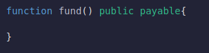
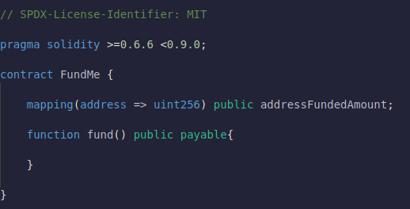
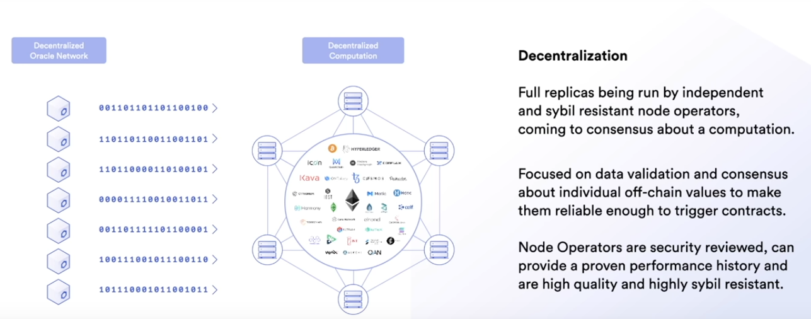
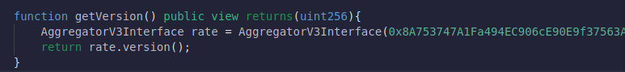
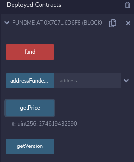

## **Lesson 3 - Fund me**

Same as before we're going to create a .sol file.We're gonna name it FundMe.sol and same as last time we add SPDX license identifier.For this lesson we'll choose solidity version >=0.6.6 <0.9.0.Create contract called "FundMe" and gonna start working.

**purpose of this contract**

We want this contract to be able to accept some type of payment.

**Payable function , wei , gwei & ether**

So let's create a new function that can accept payment.

When we define function as `payable` which means that function is used to pay for things.Every single function call has an associated value with it.Whenever you make a transaction, you can always append a value.That value is how much `wei` or `gwei` or `finney` or `ether` you're gonna send with your function call or your transaction.

As we mentioned before `wei`, `gwei` and `ether` are just different ways to talk about how much ether you're gonna send.If we look at ethereum converter, it shows how much gwei equals to 1 eth.

1 Wei is the smallest denomination of Ethereum.You can't break Ethereum into anything smaller than 1 wei.This is why when you're talking about how much something costs everything always defaults to wei.

Let's deploy the contract and see what it got.

The button is red because it's a payable function.If I click fund button, I can add value associated with it.

So what we want to do with this funding?What do we do when people send something?

Well Let's keep track of who sent us funding.We can create a new mapping between addresses and value.

**Mapping , msg. sender , msg.value**

In this fund function let's keep track of all the people who sent us money or all the addresses that sent us some value.To do this we can use some keywords that go along every transaction.

`msg.sender` and `msg.value` are keywords in every contract call and every transaction."msg.sender" is the sender of the function call and "msg.value" is how much they sent.

So whenever we call fund function, somebody can send some value cause it's a payable function.And we gonna save everything in this "addressAmountFunded" mapping.

Let's deploy the contract:

We've a new view function "addressFundedAmount".

**Funding**

If I click directly fund, nothing gonna happen because my address is going to be sending zero.In order for me to send something, I've to add some value along with my transaction.So above we've send 1 gwei which is equal to 1000000000 wei.Before hitting fund let's copy the fake account address to retrieve the funded amount.We've called a fund function with a value of 1 gwei associated with it.If I call the addressFundedAmount with the same address, I can see how much I've funded this smart contract.We can even add more value.

When we send funds to our contracts this actually means that this contract wherever this is deployed, now is the owner of value of addressFundedAmount of ether.We now have a way to fund smart contracts.

**ETH -> USD /conversion**

In this smart contract, in this funding that we're doing we want to create a minimum value for people to be able to fund our endeavors which whatever they may be.We want to set some minimum value. Ether is great but for whatever reason we wanna work in USD or maybe in some other currency.

How are we going to get the conversion rate from that currency to a currency that we can use in this smart contract?

First thing that we're gonna need to do to set the value is to know what the Eth to USD conversion rate is because If I want to accept ethereum as the token but I want it in it's USD currency then I'm gonna need to know what that conversion rate is.  

**Deterministic problem & Oracle solution**

`So How are we going to get this data into smart contract? Where are we going to get this data from?`

Remember how we talked about blockchains being deterministic systems and oracles being a bridged between blockchains and the real world.Well this is exactly where oracle's come in.

When we're talking about these systems you know these blockchains they cannot connect to real world events.They can't connect to external systems.They can't do external computation.They're intentionally these deterministic systems.These walled gardens.In order for us to make the connection, we need a blockchain oracle.We need some type of network.

If you look at a blockchain, it can easily say 1 + 1 = 2 and every other node can easily verify this.However blockchain can't easily say let's all grab the same random number because each node is going to get a different random number.They also can't make an API call because if one node calls the API and at a different time another node calls it or specifically an http get, there could potentially get very very different results and if another node tries to replay these transactions by calling these API's again maybe 10 years in the future, there's a good chance that API is going to be depreciated and they could be hacked, malicious etc.

The other reason that blockchains are intentionally can't make an API calls because then they would be making assumptions about real world and layer1's typically don't want to have an opinion on any political or geopolitical issue.Whereas `oracle network` on the other hand can make those assumptions.

**Centralized Oracles**

The other main thing we need to talk about here is centralized oracles being main points of failures.If you or I say "I'm just going to be a the oracle.I'm going to be the one to put this data on chain.", we now have this massive centralized point of failure.We've done all this work to make our decentralized computation decentralized and on chain but we ruin all the decentrality by having a single point of failure.Remember one of the whole purposes of blockchain is so that not a single entity can flip a switch and restrict our freedom to interact.

With a centralized oracle a single entity can flip a switch and restrict our freedom to interact with eachother.

**Decentralized Oracle Networks**

We also need to get data from many different decentralized sources or do any type of computation in a decentralized manner.This is where chainlink really shines.

`Chainlink` is a modular decentralized oracle infrastructure and oracle network that allows us to get data and do external computation in a highly sybil resistant decentralized manner.

It can be as customizable as you want.As you can run with one node or many nodes or do as many nodes as you like.

**Chainlink Datafeeds**

Currently one of the most popular features of chainlink is their data feeds or their price feeds.We can even go check them out over [here](data.chain.link).

We can see number of different price feeds and the networks that are providing the prices for these specific pricing powers.We can see above there's a whole number of decentralized different oracles returning data for different price feeds.This above one is ETH/USD and it's exactly the price view we're looking for.

Having a decentralized network bring the data on chain and have it as a reference point of difinitive truth allows users to all collaborate and use this common good and it'll be cheaper, more secure and more efficient than anybody even running their own centralized oracle.These price feeds are incredibly powerful.

Additionally they're being used by some of the top protocols in the defi system right now like synthetix is securing around 2 Billion $, sushi swap for leveraging trades, set protocol commodity money, ave for understanding the price of an underlying collateral.This is an example of an out of box decentralized solutions that's already been packaged in the decentralized manner for you to consume and for you to use.This makes going to production a thousand times easier than building everything yourself

**Chainlink Code documentation on ETH/USD**

However if you want to make API calls and build your own decentralized network, you absolutely can with the chainlink API calls.We're not going to go into that here because using chainlink pricefeeds, chainlink vrf, keepernetwork and all these other pre-box decentralized services are going to make going live and going mainnet a lot easier.

You can always make a chainlink http get call as well.We're not gonna go over this because putting this into production is a little bit tricker.

If you ever want to try them out by themselves, you can head [here](https://docs.chain.link/docs/get-the-latest-price/) and click "open in remix".It'll kick us to remix edition with all the code written for us.Let's go ahead and compile it and deploy it to real network(Injected Web3 in Environment).

The code is actually for 'Kovan network'.So switch your metamask to Koven.Grab [Koven faucet](https://faucets.chain.link/kovan) if you don't have any.Let's deploy the contract, metamask is gonna pop up and we can get the latest price by clicking the button.

We can see the function does indeed returns the latest price of the ethereum.You might be asking "Why this number look so big?"Remember how we talked about wei, gwei and either.Well the reason that those exist is because decimals don't work in solidity.We actually have to return a value that's multiplied by 10 to some number.

If we get a value of 261497384316, this value is actually 2614.97384316 * 108.

Next question you might wanna ask is why did we work with this on a testnet? Why can't we do this on a local network? The answer to this is because there're no Chainlink nodes on a simulated JavaScript VMs.We'll learn later how to actually mock these interactions and mock a chainlink node returning data onto our blockchain.But for now let's head back over to the contract that we're working on so we can learn how to implement this latestprice in any contract that we ever want to.

**LatestRoundData**

Another contract called in this case called priceFeed has a function called latestRoundData which returns alot of data.

It returns a roundID which defines how many times this priceFeed has been updated, returns the price which is the actual conversion between two assets, returns a startedAt which defines when this was last updated, returns a timestamp and returns a answeredInRound.Don't worry about answerInRound for now.If you want to dive deeper into what these rounds mean and what answeredInRound means you can definately check out the [chainlink documentation](https://docs.chain.link/). 

**Importing Datafeed code from Chainlink NPM package**

How do we implement this data feed into our fundMe application?

First thing we actually need to do is import the chainlink code.

As we know an import take whatever code you're importing and stick it at the top of your project.When we import from the "@chainlink/contracts", we're actually importing from the "@chainlink/contracts" npm package.We can see and read more about this repository [here](https://www.npmjs.com/package).

**Interfaces**

If you follow that import path that we got from documentation, we'll end up on the file below.

It's what we call an interface.These contracts don't start with the contract keyword but start with interface keyword.The main difference is that you can see their functions aren't completed.They just have the function name and it's return type.

In our code here solidity doesn't natively understand how to interact with another contract.We've to tell solidity what functions can be called on another contract.This is where `interfaces` are actually going to come in.Similar to structs what we can do with interfaces to find a new type.

**ABI/Application Binary Interface**

Remember how we said before we talked a little bit about ABI.Interfaces actually compile down to ABI.It tells solidity what functions can be called on another contract.We need solidity to know what functions it can use and what functions it can call other contracts with.

Anytime you're going to interact with another contract in solidity or smart contract programming in general, you're going to need that contracts ABI.We'll go into what these ABI's looks like a little bit later.

**Interacting with an Interface Contract**

How do we work with interface contract?

To interact with an interface contract it's going to work the exact same way is interacting with struct or a variable.

Let's define a new function called getVersion and we're going to call the version function of interface on our contract.

The same way we define variables and structs, we define working with other contracts and interfaces.

First thing we named is type which is AVI.Since we're inside of a contract, we're going to skip visibility and give the name "rate".Then we initialize a contract.How do we actually choose where to interact with the AVI contract?Well we pass the address of where the contract is located.

**Finding the Pricefeed Address**

In order to find where this ETH/USD pricefeed contract is located on the Rinkeby chain, we can look at the [ethereum price feeds](https://docs.chain.link/docs/ethereum-addresses/) chainlink documentation.It has a ton of different price feeds and even more not price feeds related data.Scroll to Rinkeby because on each different chain the contract address that has all the price feed information is going to be different.Scroll down and find ETH/USD.

Copy that address and pass it to AVI initialization.

`It's saying that we've a contract that has "AggregatorV3Interface" contract's function defined in the interface located at that address.`If that's true, we should be able to call "rate.version".

**Deploying**

Let's compile it and deploy it to testnet(Injected Web3 as Environment).`Remember that address is located on a actual testnet.On an actual network.`We'll learn later on how we can actually work with a simulated chain and work with these price feeds but that's much later in the journey.

We can see that the version of our aggregatorV3Interface is version 4.So we just made a contract call to another contract from our contract using an interface.This is why interfaces are so powerful because they're a minimalistic view into another contract.

**Getprice function**

This is great we've a getVersion function but this still isn't the function that we want.We want to call a getprice function which if we look at our interface, we can see there's a latestRoundData function that returns an answer.

Let's go ahead and make a function that calls getprice instead.

**Tuples**

This latestRoundData function returns five variables.So how do we actually work with that? 

A tuple is a list of objects of potentially different types whose number is a constant at compile-time.We can define several variables inside tuples.

Since lastRoundData function returns five different values, we can also make out contract return those five values.That above is a syntax for getting a tuple.Although our compiler will give us some warnings, it's saying unused variables because we're not using them for anything.We'll come back to that.

Then we can pick the variables that we want to return. Answer is the rate so we return that.

**Typecasting**

But compiling the code gives an error.It says return type argument int256 is not implicitly convertible to expected type."Answer" is an int256 and we want to return uint256.How do we rectify this?

We can fix the error by typecasting.Integers in solidity are really easy to cast into eachother.We could just do:

Now our compiler is happy.This getPrice function should return the latest price of Ethereum in terms of USD.

**Deploying**

Let's go ahead and deploy this contract.

We can know the rate of Ethereum in terms of USD is 2746.19432590 $.

**Clearing unused Tuple Variables & Deploying**

Let's clean up the function before we go up.As you can see one thing the compiler is complaining about is we've unused local variables but latesRoundData returns five different variables.How do we actually return the five variables but make our compiler happy with us?

We can actually return blanks for each one of the unused sections with commas in between eachother like:

**Wei/Gwei Standard (Matching Units)**

Let's put everything into the gwei/wei standard.We saw that getPrice has 8 decimal places.However the smallest unit of measure, it has 18.So typically let's make everything have 18 decimals as well.You don't have to do this and it'll save some gas if you don't.We could do:

`return uint256(answer * 10000000000);`

**getting the price using Get conversion rate**

We've the price of Ethereum in USD.We could set the price of our funding function to anything that we want.For example let's say 50$.We could convert whatever value they send us to it's USD equivalent and see if it's greater than or less than 50$.

Let's make a new function that converts that value that they send to its USD equivalent.

Let's test this out and see why we have to do one more thing?

This seems like a really big number i.e 2746194325900.00000000.This says that 1gwei is equal to 2746194325900 in USD.The price of 1ETH is not even that much.The reason that's off is we've to divide by 100000000.Both ethPrice and fundedAmount has 1019 tacked on to them.

