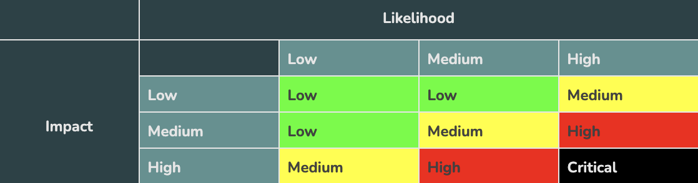
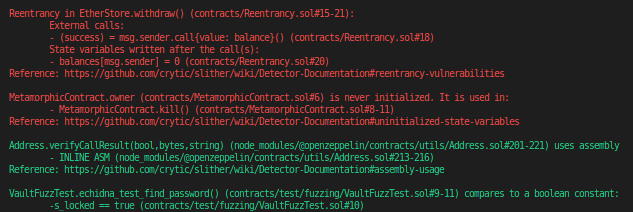
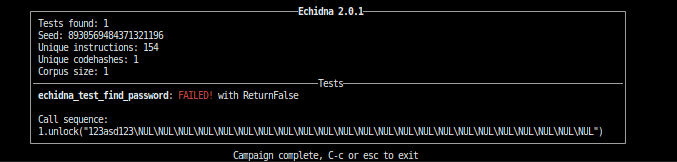

## Security and Auditing

This is going to be little bit less coding and more explaining.We've gone to a couple of tips about different security features.We talked about re-entrancy, oracle manipulation and some of the tools that we can use to make our code more efficient, to look out for bugs and to make our code more secure.

**What is an Audit?**

An Audit is a security focused code review looking for issues with your code.For example let's say we have a code that looks like this:

```solidity
// SPDX-License-Identifier: MIT
pragma solidity ^0.8.0;

contract EtherStore {
    mapping(address => uint256) public balances;

    function deposit() external payable {
        balances[msg.sender] += msg.value;
    }

    function withdraw() external {
        uint256 balance = balances[msg.sender];
        require(balance > 0);
        (bool success, ) = msg.sender.call{value: balance}("");
        require(success, "Failed to send Ether");
        balances[msg.sender] = 0;
    }

    function getBalance() external view returns (uint256) {
        return address(this).balance;
    }
}

// How could you make a contract that exploits this?

```

This should be a little bit familiar because we talked about this in one of our earlier sections with [re-entrancy](https://github.com/spo0ds/Journey-to-become-a-Blockchain-Engineer/blob/main/Day52/Day52.md).Our code withdraw sends ether and then updates the balances.This code is clearly vulnerable to re-entrancy attack here and this is something as auditor would catch.Since when we deploy our code that code is immutable and that code will always be there, it's really important to have these security reviews done before we deploy our code to mainnet.So if you're going to deploy a crazy massive defi protocol, and you're going to have billion's of dollarsof people money locked into your protocol, you probably want to make sure that the money is going to go to the correct places.So audits are incredibly important for the lifecycle of our projects.

When we send our code to audit, we shouldn't just say "Hey here's our code.Can you check to make sure it's good?"That's not going to give an auditor enough information.They need to be very easily know what your code does, how to work with it and what you're looking for because auditors aren't going to be kind of this failsafe where if your code is terrible, they're going to catch everything.Auditors are human beings too.They can miss things as well.They also don't make sure that your code is bug free.Audits are security focused peer reviews for your codebase and when you do send your code to audit, you want to make sure you help out your auditors as much as possible.

[OpenZeppelin](https://learn.openzeppelin.com/security-audits/readiness-guide) has a readiness guide to try to help you make sure that you're even ready for an audit in the first place.The summary of them are:


    Add comments
        This will help your auditors understand what you're doing.
    Use natspec
        Document your functions. DOCUMENT YOUR FUNCTIONS.
    Test
        If you don't have tests, and test coverage of all your functions and lines of code, you shouldn't go to audit. If your tests don't pass, don't go to audit.
    Be ready to talk to your auditors
        The more communication, the better.
    Be prepared to give them plenty of time.
        They literally pour themselves over your code.


**Process**

Let's talk about the auditing process.

  -  Run tests
  -   Read specs/docs
  -   Run fast tools (like slither, linters, static analysis, etc)
  -   Manual Analysis
  -   Run slow tools (like echidna, manticore, symbolic execution, MythX)
  -   Discuss (and repeat steps 
    as needed)
  -   [ Write report](https://github.com/transmissions11/solmate/blob/main/audits/v6-Fixed-Point-Solutions.pdf)

Typically, you organize reports in a chart that looks like this:



`Static Analysis` is the process of just running some program to read all your code and look for commonly known bugs.One of the most popular static analysis tools is going to be this tool called `Slither` and this is going to be one of the first thing that we're going to do here.

So let's go ahead and make a new directory called `hardhat-security` and open it in VScode.Instead of starting from a new folder and everything, clone the code from my Repo.This comes with a couple of different contracts for us already that each have a different vulnerability.One of then is `BadRNG`.This is a contract that picks a random winner of a raffle using `block.difficulty` and `msg.sender`.This isn't truly random as the miner can influence block.difficulty, and people can cancle transactions.There's ton of ton different vulnerabilities with creating randomness in this way.

We also have `LiquidityPoolAsOracle`.The two most common types of attack are re-entrancy and oracle manipulation attacks which we know how to use decentralized oracle which should make us alot safer.

We're using liquidity pool as a oracle and this is kind of some advanced defi stuff.This is a minimalistic decentralized exchange example where people can buy, sell and swap different assets.Using this singular exchange, to get the swap price is a terrible idea because this is a single protocol for a single price.The price from this protocol is a single centralized location, and we don't want to get our price from a single centralized exchange.We want to get it from many exchanges.Getting the price of any asset from a single decentralized exchange is not decentralized because somebody can manipulate the market, so some crazy advanced defi things that will ruin the price of your assets.So getting the price of your assets from a centralized location is a terrible idea.

We've a metamorphic proxy here.

```solidity
// SPDX-License-Identifier: MIT
pragma solidity 0.8.7;
import "@openzeppelin/contracts/proxy/utils/Initializable.sol";

contract MetamorphicContract is Initializable {
    address payable owner;

    function kill() external {
        require(msg.sender == owner);
        selfdestruct(owner);
    }
}
```

The issue here is that it's initializable and we don't gurantee that the contract has been initialized.We've a classic `re-entrancy` issue here and a `vault` here where some password is stored on-chain and we're crossing our fingers that nobody reads this password to unlock it.We're going to run static analysis on these contracts and see if that static analysis can spot some of the bad things in here.

**Slither**

To get started, we're going to use the tool called "Slither".This is created by `Crytic` team aka `TrailofBits`.They put out open source security tools such as slither.To get started with slither, we actually needs to install python first.You can check your python verson by:

`python3 --version`

Once you install python, you should also have this tool `pip3`.

`pip3 --version`

We also need to install solc-select package just in case we're using weird version of solidity.

`pip3 install solc-select`

Then we can do `solc-select use *solidity-version* ` to work with.

Once you have those tools, you can just run `pip3 install slither-analyzer`.In our package.json, we actually have command for running slither.

```json
    "slither": "slither . --solc-remaps '@openzeppelin=node_modules/@openzeppelin @chainlink=node_modules/@chainlink' --exclude naming-convention,external-function,low-level-calls",
```

Now we can run slither on our contracts folder by running the big command above.First run `yarn` to install all of the packages.After we've installed all of our packages, we can run `yarn slither`.We get this massive output that looks like this.



It'll list out number of lines and then a reference to that issue in and each one of these is seperated by new line.If we get a read color, that means that it's a high impact issue that we definately should address and it even comes with reference link and see what the issue is and get more information from the slither tool.

We can see it catches our metamorphic contract issue.It says "metamorphic contract is never initialized.It's used in metamorphic.kill()."The reason that this is a massive issue, if we go to our metamorphic contract, if we deploy this contract somebody else could initialize this code, become the owner and then automatically kill it before we even have a chance.This is actually something that has happened in the past and has caused a ton of issues.

Now there's going to be ton of green in here.These are detectors that are probably low impact and they're probably okay.Jus by running the slither tool, we can catch a re-entrancy vulnerability in one of our contracts which is fantastic.So running the static analysis caught at least two huge vulnerabilities.It didn't catch the issues involved at Vaults, LiquidityPoolAsOracle and BadRNG which is why we don't only want to rely on slither because it's not going to catch everything, but it'll catch a major vulnerabilities.So this is how we can use slither from a middilistic point.

**Fuzzing and eth-security-toolbox**

After we run a tool like that, we enter `manual analysis` where we walk through the code ourselves manually, and maybe we do in tangent with running some slower tools like `echidna`, `manticore` and `symbolic execution`.Symbolic execution is where we simulate executing transactions on the blockchain and one of these symbolic execution tools that we're going to work with is `echidna` tool.

Again this is a trail of bits tool for doing something called fuzz testing.Now in programming, fuzzing or fuzz testing is an automated software testing technique that involves providing invalid, unexpected or random data as inputs to a computer program.In lot of our code, oftentimes, we're going to get people interacting with them in ways that we'll never think about.So we want to be able to provide random data and information to our test to see if something weird happens that we're not expecting.So we can actually build our own fuzz tests in our hardhat project and run these fuzz tests.

We write our fuzz tests in solidity, actually as opposed to writing our tests in JavaScript.Let's say for example we've built the vault contract and we think that at first glance, "Nobody should be able to know the passwor, and no one should be able to unlock the contract." which obviously we know is ridiculous because we know that anybody can read anything in a storage variable.So we know that this should fail.It might be hard to write a test to actually catch  that this actually would fail.A good approach to testing this would be to just send a ton of random bytes32 object to unlock function to see if we can unlock it.

We can write a fuzz test to do exactly that.So create a new folder inside contracts "test" and inside it create a new folder called "fuzzing" and inside it create a new file called "VaultFuzzTest.sol".


```solidity
// SPDX-License-Identifier: MIT
pragma solidity ^0.8.7;

import "../../Vault.sol";

contract VaultFuzzTest is Vault {
    constructor() Vault("123asd123") {}

    function echidna_test_find_password() public view returns (bool) {
        return s_locked == true;
    }
}
```

We've a password of `123asd123` and we've a function called `echidna_test_find_password` where it's going to send a ton of random data into vault to try to make s_locked to `false`.We could install just echidna but at this point it's good idea to bring up `security-toolbox` from trailofbits which has all their security tools in one single container.T o work with this toolbox, we need to have docker installed.

`sudo apt install docker.io`

Once we've the docker installed, we can run the eth-security-toolbox by pulling it down from the docker equivalent of Github.In package.json, we have the command to get set up.

```json
"toolbox": "docker run -it --rm -v $PWD:/src trailofbits/eth-security-toolbox",
```

So we can just run `yarn toolbox` which will run the docker command.This will stick up to a new shell to work with any of the tools provided by trail of bits.Our vault fuzz test, comes with the config as well.This is an yaml file with all our arguments for running a echidna.So it has testLimit for how many runs, we should do, timeDelay, blockDelay and then some re-mappings.The docker shell will have the security tool already installed like `echidna-test /src/contracts/test/fuzzing/VaultFuzzTest.sol --contract VaultFuzzTest --config /src/contracts/test/fuzzing/config.yaml`.

It'll give us an output that looks like this.



It has found an usecase where it can make s_locked = false and the use case is "123asd123".This is why running a fuzz testing can be so powerful.we thought our contract is secure but we immediately found the password which means anybody else could immediately find the password.This is an indicator that what we're doing is not a good setup.We'll hit `ctrl` + `C` to exit test and to leave docker setup we'll run `exit`.

So if you're not going to be an auditor, you just want to deploy things to mainnet, always before you deploy anything the absolute minimum that you should be doing is always running slither and then looking manually for oracle manipulation and re-entrancy attack.If you see in your code that you're getting pricing information from a centralized location, rethink that scenario.If you're getting random number or anytype of automation from a centralized location, rethink it and change your strategy.The chainlink oracle network has been created for a reason to prevent getting hacked like this.

#### The types of smart contract vulnerabilities that have occurred in the past:

Reentrancy Attacks: This type of vulnerability allows attackers to repeatedly enter and exit a smart contract to steal funds or cause it to malfunction.

Integer Overflow/Underflow: This type of vulnerability occurs when a contract's arithmetic calculations exceed the maximum or minimum value that can be represented, causing unexpected behavior.

Authorization Flaws: This type of vulnerability occurs when a smart contract's access control mechanism is not correctly implemented, allowing unauthorized access to sensitive functions or data.

Time Manipulation: This type of vulnerability occurs when smart contracts rely on time-based events to execute their functions, which can be manipulated by attackers.

Front-Running Attacks: This type of vulnerability occurs when attackers can see and copy transactions before they are executed, allowing them to exploit price discrepancies or manipulate the contract's behavior.

Lack of Input Validation: This type of vulnerability occurs when smart contracts do not properly validate input data, allowing attackers to inject malicious code or data.

Misconfigured Parameters: This type of vulnerability occurs when a smart contract's configuration parameters are not set correctly, causing unexpected behavior or opening up security risks.